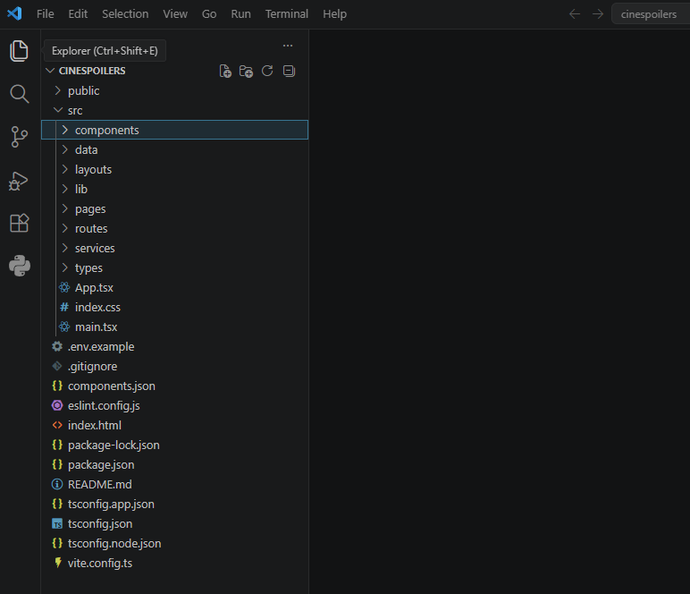
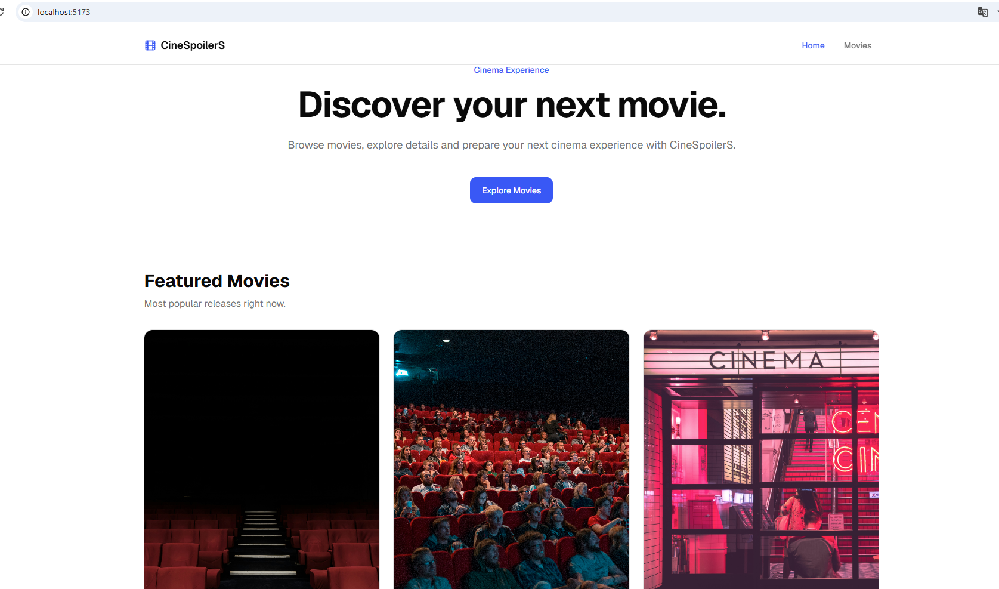
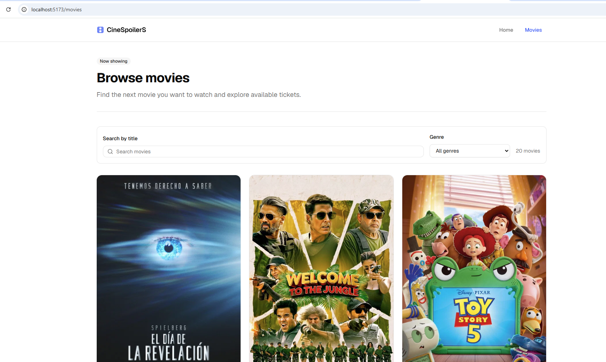
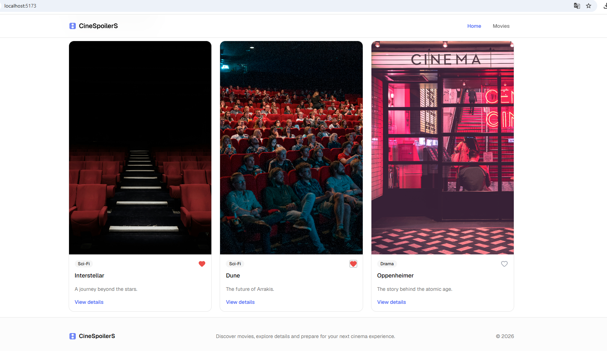
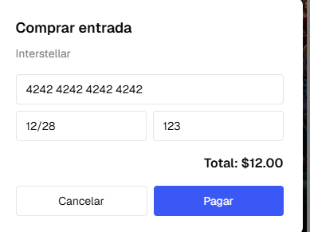
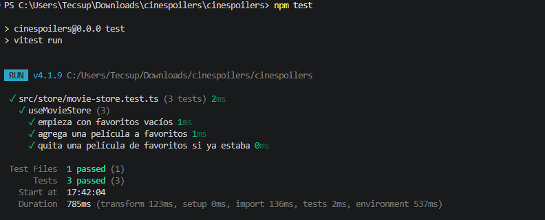

# 🎬 CineSpoilerS

Aplicación web de catálogo de películas construida con React, TypeScript y Vite, que consume la API de TMDB (The Movie Database) para mostrar películas populares en tiempo real.


## 📋 Descripción

CineSpoilerS permite a los usuarios explorar el catálogo de películas populares, buscar por título, filtrar por género, marcar favoritas y simular la compra de entradas.

## ✨ Funcionalidades

- 🎞️ **Catálogo de películas** — consumo en tiempo real de la API de TMDB
- 🔍 **Búsqueda por título** y **filtro por género**
- ❤️ **Favoritos** — estado global gestionado con Zustand
- 💳 **Pasarela de pago simulada** para compra de entradas
- ✅ **Tests unitarios** con Vitest
- 🎨 **UI moderna** con Tailwind CSS y shadcn/ui

## 🛠️ Stack tecnológico

| Categoría | Tecnología |
|---|---|
| Framework | React 19 + TypeScript |
| Bundler | Vite |
| Estilos | Tailwind CSS + shadcn/ui |
| Fetching de datos | TanStack Query (React Query) + Axios |
| Estado global | Zustand |
| Routing | React Router |
| Testing | Vitest |
| API externa | [TMDB API v3](https://developer.themoviedb.org/reference/getting-started) |

## 🚀 Instalación y ejecución

### 1. Clonar el repositorio

```bash
git clone https://github.com/saraisoto-crypto/examen-DesApliEmp.git
cd examen-DesApliEmp
```

### 2. Instalar dependencias

```bash
npm install
```

### 3. Configurar variables de entorno

Crea un archivo `.env` en la raíz del proyecto (usa `.env.example` como referencia):
VITE_TMDB_TOKEN=tu_token_de_tmdb
VITE_TMDB_BASE_URL=https://api.themoviedb.org/3
VITE_TMDB_IMAGE_URL=https://image.tmdb.org/t/p

> Obtén tu token gratuito en [themoviedb.org/settings/api](https://www.themoviedb.org/settings/api)

### 4. Levantar el proyecto

```bash
npm run dev
```

Abre [http://localhost:5173](http://localhost:5173)

### 5. Correr los tests

```bash
npm test
```

## 📸 Evidencia de requisitos

### a. Clonar repositorio


### b. Levantar proyecto


### c. Consumir data de TMDB
Catálogo de películas obtenido en tiempo real desde la API de TMDB, con búsqueda y filtro por género funcionando.



### d. Implementar estado global (Zustand)
Sistema de favoritos gestionado con Zustand — el estado persiste entre componentes sin prop drilling.



### f. Pasarela de pago (Simulación)
Modal de compra de entradas con formulario simulado y confirmación de pago.



### g. Tests
Suite de tests unitarios para el store de favoritos, corriendo con Vitest.



## 📁 Estructura del proyecto
src/
├── components/     # Componentes reutilizables (UI, movies, payment, layout)
├── data/           # Datos estáticos (legacy, reemplazado por TMDB)
├── layouts/        # Layouts de la aplicación
├── lib/            # Cliente de TMDB, adaptadores y utilidades
├── pages/          # Páginas de la app (home, movies, movie-detail)
├── routes/         # Configuración de rutas
├── store/          # Estado global (Zustand)
├── types/          # Tipos de TypeScript
└── main.tsx        # Punto de entrada

## 👤 Autora

**Sarai Soto**
Tecsup — Desarrollo de Aplicaciones Web (Sección C-24)
[github.com/saraisoto-crypto](https://github.com/saraisoto-crypto)